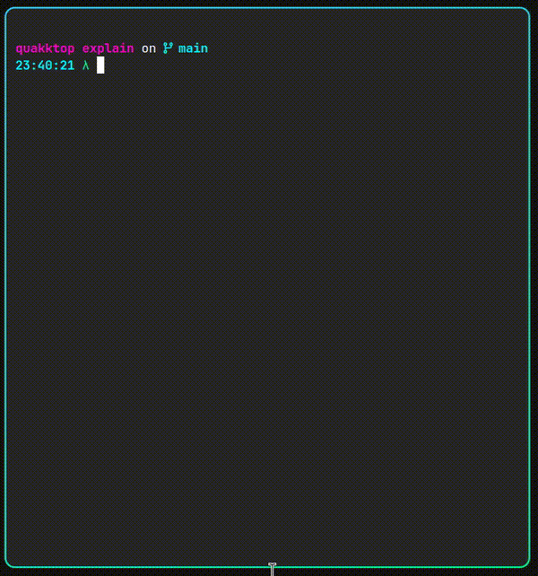
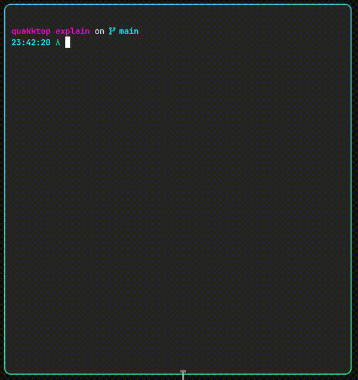

# Explain CLI

A command-line tool that uses OpenAI's GPT models to explain anything you throw at it. Whether you have a quick question or need detailed analysis of complex content, `explain` provides intelligent responses right in your terminal. AI wrote this readme.

## Demo

### Basic input with arguments


### Explain piped input


## Features

- **Multiple Input Methods**: Support for direct questions and piped content
- **Smart Mode**: Advanced reasoning with o1 models for complex topics
- **Verbose Mode**: Detailed configuration and processing information
- **Input Validation**: Automatic token counting and size limits
- **History**: Stores history in a local sqlite database

## Installation

### Prerequisites

- [.NET 9.0 SDK](https://dotnet.microsoft.com/download/dotnet/9.0) (for building from source)
- OpenAI API key

### Quick Setup

1. **Clone the repository**:
   ```bash
   git clone https://github.com/grankko/explain.git
   cd explain
   ```

2. **Configure your API key**:
   ```bash
   # Depending on how you do this you might be exposing that api key more than you should
   #
   # Option 1: Create user configuration (recommended)
   mkdir -p ~/.config/explain
   cp src/Explain.Cli/appsettings.example.json ~/.config/explain/appsettings.json
   # Edit ~/.config/explain/appsettings.json with your OpenAI API key
   
   # Option 2: Use application directory configuration
   cp src/Explain.Cli/appsettings.example.json src/Explain.Cli/appsettings.json
   # Edit src/Explain.Cli/appsettings.json with your OpenAI API key
   
   # Option 3: Use environment variables (works with any setup)
   export EXPLAIN_OPENAI_KEY="your-api-key-here"
   ```

3. **Build and publish**:
   ```bash
   chmod +x publish.sh
   ./publish.sh
   ```

4. **Install globally** (optional):
   ```bash
   # The publish script creates a self-contained executable at publish/explain
   # You can copy it to your PATH or use the provided wrapper script
   ```

## Configuration and Data Storage

The `explain` CLI uses a user configuration directory for storing settings and data:

- **Configuration Directory**: `~/.config/explain/`
- **Database Location**: `~/.config/explain/explain_history.sqlite`
- **User Config File**: `~/.config/explain/appsettings.json` (optional)

### Configuration Priority

The application loads configuration in the following order (higher priority overrides lower):

1. **Command line arguments** (highest priority)
2. **Environment variables**: 
   - `EXPLAIN_OPENAI_KEY`
   - `EXPLAIN_OPENAI_MODEL_NAME` 
   - `EXPLAIN_OPENAI_SMART_MODEL_NAME`
3. **User configuration file**: `~/.config/explain/appsettings.json`
4. **Application configuration file**: `src/Explain.Cli/appsettings.json` (lowest priority)

The configuration directory and database are automatically created when the application first runs.

## Usage

### Direct Questions
```bash
explain "What is machine learning?"
explain "How do I list hidden files in Linux?"
explain "Explain quantum computing in simple terms"
```

### Including History Context
Include previous conversations for context-aware responses:
```bash
# Include last 3 history entries (default)
explain "What about supervised learning?" --include-history

# Include last 5 history entries  
explain "Can you elaborate on that?" --include-history 5

# Include all history entries
explain "Summarize our entire conversation" --include-history 0
```
### Smart Mode
For complex topics requiring deep reasoning:
```bash
explain "Analyze the trade-offs between microservices and monolithic architecture" --think
```

### Piped Input
Analyze files, command output, or any text content:
```bash
# Explain file contents
cat README.md | explain

# Analyze command output
ls -la | explain "What do these file permissions mean?"

# Process log files
tail -n 100 /var/log/syslog | explain "Summarize any issues"

# Explain code
cat main.py | explain "What does this Python code do?"

# Handle error messages (stderr)
dmesg 2>&1 | explain "Why did this fail?"
```

### History Management
View your previous questions and explanations:
```bash
# Show last 5 questions (default)
explain --show-history

# Show last 10 questions
explain --show-history 10

# Show all history
explain --show-history 0
```

Clear all history entries:
```bash
# Clear all history (requires typing 'yes' to confirm)
explain --clear-history
```

**Note**: The `--show-history` and `--clear-history` flags cannot be combined with other input methods (questions, piped content, or other flags).

### Command Line Options

- `--verbose`: Display detailed configuration and processing information
- `--think`: Use advanced reasoning mode with o1 models for complex analysis
- `--include-history [number]`: Include previous questions and explanations as context
  - Without number: Includes last 3 entries (default)
  - With number: Includes specified number of entries
  - With 0: Includes all history entries
  - History is NOT included by default - this is an opt-in feature
- `--show-history [number]`: Display previous questions and explanations
  - Without number: Shows last 5 entries (default)
  - With number: Shows specified number of entries
  - With 0: Shows all history entries
  - Cannot be combined with other input or flags
- `--clear-history`: Clear all history entries
  - Requires typing 'yes' to confirm deletion
  - Cannot be combined with other input or flags

### Building and Testing

```bash
# Build the project
dotnet build src/Explain.Cli/Explain.Cli.csproj

# Run unit tests only (default - integration tests are ignored)
dotnet test src/Explain.Cli.Tests/

# Run integration tests specifically (requires temporarily uncommenting [Ignore] attributes)
# Comment out the [Ignore] attributes in IntegrationTests/ExplainCommandIntegrationTests.cs first
dotnet test src/Explain.Cli.Tests/ --filter "FullyQualifiedName~IntegrationTests"

# Debug mode
dotnet run --project src/Explain.Cli -- "your question here"
```

**Note**: Integration tests are ignored by default to prevent environment lockup during regular test runs. They test the CLI as a separate process and require the application to be built first.

### VS Code Integration

The project includes VS Code configuration for easy development:

- **F5**: Start debugging with sample arguments
- **Build task**: Available in the command palette
- **Launch configurations**: Pre-configured for different scenarios

### Publishing

Use the included publish script for creating distributable executables:

```bash
./publish.sh
```

This creates a self-contained Linux executable at `publish/explain` with all dependencies included.